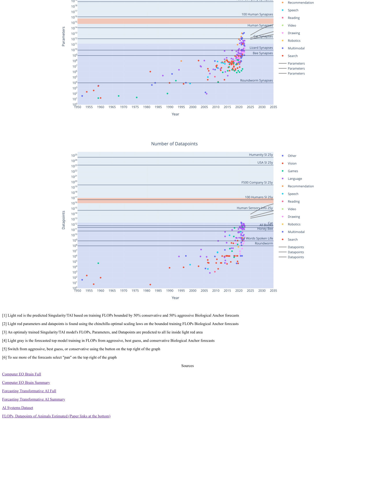

# Collection of Data on AI Progress as of 2022 (Work in Progress)

Download and open the html file in the zip file to view website. Keep in mind it is a work in progress so it is still rough.

# Motivation
It started when I was looking for data on AI models history, model costs, countries AI progress compared, AI papers published, Hardware progress data, benchmark progress, forecasting data, possible effects of AI, etc... And I couldn’t find it and/or it was frustrating to get access to the excel data. A lot of the data didn't exist or was scattered all over the internet. I would have loved to have a simple centralized location with all the data visualized with graphs and a download excel sheet button.

I combine a lot from Epoch: “Parameter, Compute and Data Trends in Machine Learning” and Open Philanthropy: “Forecasting TAI with biological anchors” and “How Much Computational Power Does It Take to Match the Human Brain?”, along with a lot of other data scattered around the internet.

The hope is after it's done AI alignment, forecasters, and people interested in AI can check this website/paper to see "where are we in AI as of today and the history/trends". Also, researchers can easily download and reference the data. Potentially the average person could look at the AI progress that's been made over the years and possibly take AI alignment more seriously.

  

  

